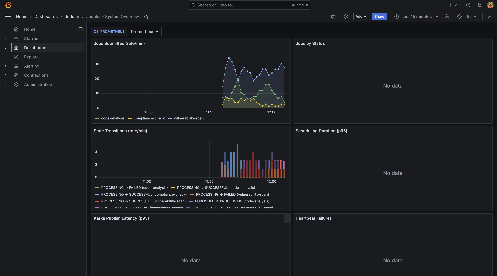
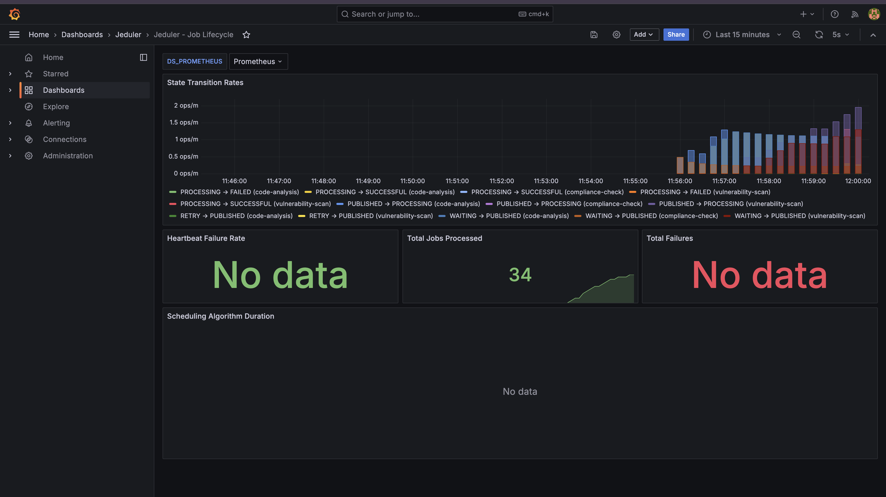

# Jeduler

A distributed job scheduling and execution system with intelligent concurrency control, heartbeat-based liveness monitoring, and Kafka-based job dispatching.

## Overview

Jeduler solves the problem of **scheduling jobs with complex concurrency constraints**. When you have hundreds of jobs competing for limited execution slots — with limits per tenant, per job type, per resource — Jeduler's concurrency maximization algorithm fills all available slots optimally while respecting every constraint simultaneously.

The system is fully containerized. A single `docker-compose up` brings the entire stack online with zero manual configuration, pre-built Grafana dashboards, and a live demo workload.





---

## Architecture

### System Architecture

```
┌─────────────────────────────────────────────────────────────────────────────────┐
│                              DOCKER COMPOSE NETWORK                               │
│                                                                                   │
│                                                                                   │
│  ┌──────────────┐         ┌──────────────────────────────────────────┐           │
│  │   Demo       │  HTTP   │         JEDULER SCHEDULER                │           │
│  │  Producer    │────────▶│         (Spring Boot + Java 21)          │           │
│  │  (Python)    │         │                                          │           │
│  └──────────────┘         │  ┌─────────────┐  ┌──────────────────┐  │           │
│                            │  │  REST API   │  │ Scheduling Engine │  │           │
│                            │  │  Layer      │  │                  │  │           │
│                            │  │             │  │ • Iterative      │  │           │
│                            │  │ • Submit    │  │   Greedy Fill    │  │           │
│                            │  │ • Status    │  │ • Event-driven   │  │           │
│                            │  │ • Heartbeat │  │   Triggers       │  │           │
│                            │  │ • Manage    │  │ • Cold Scheduler │  │           │
│                            │  └──────┬──────┘  └────────┬─────────┘  │           │
│                            │         │                  │            │           │
│                            │         ▼                  ▼            │           │
│                            │  ┌─────────────┐  ┌──────────────┐     │           │
│                            │  │   Service   │  │Kafka Producer │     │           │
│                            │  │   Layer     │  │              │     │           │
│                            │  │             │  │ • Idempotent  │     │           │
│                            │  │ • Job CRUD  │  │ • acks=all    │     │           │
│                            │  │ • Lifecycle │  │ • LZ4 compress│     │           │
│                            │  └──────┬──────┘  └──────┬───────┘     │           │
│                            │         │                │              │           │
│                            │  ┌──────┴────────────────┴──────────┐  │           │
│                            │  │    Redis Client (Redisson)        │  │           │
│                            │  │    • Atomic Counters (INCR/DECR)  │  │           │
│                            │  │    • TTL-based Heartbeats          │  │           │
│                            │  └──────┬────────────────┬──────────┘  │           │
│                            └─────────┼────────────────┼──────────────┘           │
│                                      │                │                           │
│          ┌───────────────────────────┼────────────────┼──────────────┐           │
│          │                           │                │              │           │
│          ▼                           ▼                ▼              │           │
│  ┌──────────────┐          ┌──────────────┐   ┌──────────────┐     │           │
│  │  PostgreSQL  │          │    Redis     │   │    Kafka     │     │           │
│  │    :5432     │          │    :6379     │   │    :9092     │     │           │
│  │              │          │              │   │   (KRaft)    │     │           │
│  │ • Job state  │          │ • Concurrency│   │              │     │           │
│  │   (source of │          │   counters  │   │ • Per-type   │     │           │
│  │    truth)    │          │ • Heartbeat  │   │   topics     │     │           │
│  │ • Config     │          │   TTL keys  │   │ • Ordered    │     │           │
│  │ • Partial    │          │ • Sub-ms    │   │   delivery   │     │           │
│  │   indexes    │          │   latency   │   │              │     │           │
│  └──────────────┘          └──────────────┘   └──────┬───────┘     │           │
│                                                       │             │           │
│                                                       ▼             │           │
│                                               ┌──────────────┐     │           │
│                                               │   Demo       │     │           │
│                                               │  Consumer    │     │           │
│                                               │  (Python)    │     │           │
│                                               │              │     │           │
│                                               │ • Poll Kafka │     │           │
│                                               │ • Heartbeat  │     │           │
│                                               │ • Report     │     │           │
│                                               │   status     │     │           │
│                                               └──────────────┘     │           │
│                                                                     │           │
│  ┌──────────────┐          ┌──────────────────────────────────┐    │           │
│  │  Prometheus  │◀─scrape──│ /actuator/prometheus (15s)       │    │           │
│  │    :9090     │          └──────────────────────────────────┘    │           │
│  └──────┬───────┘                                                   │           │
│         ▼                                                           │           │
│  ┌──────────────┐                                                   │           │
│  │   Grafana    │  Pre-provisioned dashboards:                      │           │
│  │    :3000     │  • System Overview                                │           │
│  │              │  • Concurrency Monitor                            │           │
│  │              │  • Job Lifecycle                                   │           │
│  └──────────────┘                                                   │           │
│                                                                                   │
└─────────────────────────────────────────────────────────────────────────────────┘
```

### Data Flow

```
Producer ──POST /api/v1/jobs──▶ Scheduler ──INSERT──▶ PostgreSQL (WAITING)
                                    │
                                    ▼
                          Scheduling Engine triggered
                                    │
                    ┌───────────────┼───────────────────┐
                    ▼               ▼                   ▼
              Check Redis     Query DB for        Check all
              global count    candidates          rule dimensions
                    │               │                   │
                    └───────────────┼───────────────────┘
                                    │
                              [If capacity]
                                    │
                    ┌───────────────┼───────────────────┐
                    ▼               ▼                   ▼
              INCR Redis      UPDATE DB            Publish to
              counters        (→ PUBLISHED)        Kafka topic
                                                       │
                                                       ▼
                                                  Consumer polls
                                                       │
                              ┌─────────────────────────┼────────────────┐
                              ▼                         ▼                ▼
                        POST /status             POST /heartbeat    Process job
                        (PROCESSING)             (every 15s)        (5-30s)
                              │                                          │
                              │                         ┌────────────────┘
                              │                         ▼
                              │                   POST /status
                              │                   (SUCCESSFUL or FAILED)
                              │                         │
                              └─────────────────────────┼────────────────┐
                                                        ▼                ▼
                                                  DECR Redis       Re-trigger
                                                  counters         scheduling
                                                                   (fill freed slot)
```

### Concurrency Maximization Algorithm

The core scheduling algorithm uses **iterative greedy fill** to pack the maximum number of jobs into available slots:

```
┌─────────────────────────────────────────────────────────────┐
│  Concurrency Rule: vulnerability-scan                        │
│  { "tenant": 3, "_global": 10, "scanType": 5 }             │
├─────────────────────────────────────────────────────────────┤
│                                                              │
│  _global:    [████████░░] 8/10  (2 slots free)              │
│  tenant:101: [███░]        3/3   (FULL!)                    │
│  tenant:102: [██░░]        2/3   (1 slot free)              │
│  tenant:103: [█░░░]        1/3   (2 slots free)             │
│  scanType:   [████░]       4/5   (1 slot free)              │
│                                                              │
│  Iteration 1: Try J1 (tenant=101) → BLOCKED (tenant full)  │
│  → Mark {tenant: 101} as exhausted                          │
│                                                              │
│  Iteration 2: Try J4 (tenant=102) → ALL PASS → Schedule!   │
│  Iteration 2: Try J5 (tenant=103) → ALL PASS → Schedule!   │
│                                                              │
│  Result: 2 jobs scheduled (global now 10/10 = FULL)         │
└─────────────────────────────────────────────────────────────┘
```

### Job Lifecycle State Machine

```
                    ┌────────────────────────────────────────────────┐
                    │                                                │
                    ▼                                                │
                WAITING ──────────▶ PUBLISHED ──────────▶ PROCESSING │
                  │                     │                     │      │
                  │                     │                     │      │
                  ▼                     ▼                     ├──▶ SUCCESSFUL
               CANCELLED          CANCELLED                  │
                                  (admin only)               ├──▶ FAILED ────────┐
                                                             │                   │
                                                             └──▶ FAILED_BY_     │
                                                                  SCHEDULER      │
                                                                  (heartbeat     │
                                                                   timeout)      │
                                                                       │         │
                                                                       ▼         ▼
                                                                     RETRY ──────┘
                                                                       │
                                                                       │ (re-enters
                                                                       │  scheduling)
                                                                       ▼
                                                                   PUBLISHED
```

---

## Tech Stack

| Component | Technology | Version | Purpose |
|-----------|-----------|---------|---------|
| Application | Spring Boot / Java | 3.4.1 / 21 | REST API, scheduling engine |
| Database | PostgreSQL | 16 | Job state persistence (source of truth) |
| Cache | Redis | 7 | Atomic concurrency counters, heartbeat TTL |
| Message Broker | Apache Kafka (KRaft) | 3.7 | Job dispatching to workers |
| Metrics | Prometheus | 2.52 | Time-series metrics scraping |
| Dashboards | Grafana | 10.4 | Real-time visualization |
| Demo Scripts | Python | 3.11 | Producer/consumer simulation |
| Migrations | Liquibase | 4.x | Database schema versioning |
| Redis Client | Redisson | 3.27 | Distributed objects, atomic ops |

---

## Key Design Decisions

| Decision | Choice | Rationale |
|----------|--------|-----------|
| Concurrency tracking | Redis atomic counters | Sub-ms latency for hot-path checks; INCR/DECR are race-condition-free |
| Heartbeat detection | Redis TTL keys | Keys auto-expire — no cleanup logic needed; 60s TTL = automatic failure detection |
| Job dispatching | Kafka per-type topics | Independent scaling per job type; consumer group semantics; backpressure built-in |
| State persistence | PostgreSQL with partial indexes | Source of truth; partial indexes keep scheduling queries fast over millions of rows |
| Counter reconciliation | 5-minute cron refresh from DB | Corrects any drift from edge cases; Redis counters are derived state |
| Scheduling trigger | Event-driven with deduplication | Instant response to state changes; dedup prevents thundering herd |

---

## Running the System

### Prerequisites

- Docker and Docker Compose (v2+)
- 4GB+ available RAM

### Quick Start

```bash
# Start full stack with demo workload
docker-compose --profile demo up -d

# Watch the system in action
docker-compose logs -f demo-producer demo-consumer
```

### Access Points

| Service | URL | Credentials |
|---------|-----|-------------|
| **Scheduler API** | http://localhost:8080 | — |
| **Grafana Dashboards** | http://localhost:3000 | admin / admin |
| **Prometheus** | http://localhost:9090 | — |
| **Health Check** | http://localhost:8080/actuator/health | — |
| **Metrics** | http://localhost:8080/actuator/prometheus | — |

### Stop & Clean Up

```bash
docker-compose --profile demo down       # Stop everything
docker-compose --profile demo down -v    # Stop and delete all data
```

---

## Live System Demo

When running with the demo profile, you'll observe:

### Concurrency at Maximum Utilization

```
$ curl http://localhost:8080/api/v1/concurrency/status

{
  "vulnerability-scan": { "_global": { "current": 10, "limit": 10 } },
  "code-analysis":      { "_global": { "current": 5,  "limit": 5  } },
  "compliance-check":   { "_global": { "current": 3,  "limit": 3  } }
}
```

All slots filled — the algorithm is maximizing throughput.

### Job Stats Showing Active Pipeline

```
$ curl http://localhost:8080/api/v1/jobs/stats

{
  "vulnerability-scan": { "WAITING": 258, "PUBLISHED": 10, "SUCCESSFUL": 13, "RETRY": 1 },
  "code-analysis":      { "WAITING": 192, "PUBLISHED": 4, "PROCESSING": 1, "SUCCESSFUL": 5 },
  "compliance-check":   { "WAITING": 115, "PUBLISHED": 3, "SUCCESSFUL": 6 }
}
```

### Producer Structured Logs

```
2026-07-04T06:18:11 [INFO] {"event": "job_submitted", "jobId": 28, "jobName": "code-analysis", "tenant": 103, "priority": 5, "latency_ms": 15.9}
2026-07-04T06:18:15 [WARNING] {"event": "duplicate_job", "jobName": "compliance-check", "tenant": 101, "latency_ms": 25.2}
```

### Consumer Processing Jobs

```
2026-07-04T06:18:03 [INFO] {"event": "job_received", "jobId": 10, "jobName": "vulnerability-scan", "tenant": 104}
2026-07-04T06:18:18 [INFO] {"event": "job_completed", "jobId": 10, "jobName": "vulnerability-scan", "duration_s": 14.8}
```

### Scheduling Engine Logs

```
INFO [scheduler-1] KafkaPublisherService  : Publishing job 34 to topic job-dispatch.vulnerability-scan
INFO [scheduler-1] SchedulingService      : Scheduled 2 jobs for jobName=vulnerability-scan
INFO [scheduler-5] KafkaPublisherService  : Publishing job 47 to topic job-dispatch.vulnerability-scan
INFO [scheduler-5] SchedulingService      : Scheduled 1 jobs for jobName=vulnerability-scan
```

### Grafana Dashboards

Three pre-provisioned dashboards are available at http://localhost:3000:

1. **System Overview** — Job throughput, state distribution, Kafka latency, heartbeat failures
2. **Concurrency Monitor** — Real-time utilization per rule, queue depth per job type
3. **Job Lifecycle** — State transition rates, scheduling algorithm performance

#### System Overview Dashboard


#### Job Lifecycle Dashboard


### Prometheus Metrics

```
$ curl http://localhost:8080/actuator/prometheus | grep jeduler

jeduler_jobs_total{jobName="vulnerability-scan",status="WAITING"} 258.0
jeduler_scheduling_duration_seconds_count{jobName="vulnerability-scan"} 42
jeduler_scheduling_duration_seconds_sum{jobName="vulnerability-scan"} 0.290
jeduler_kafka_publish_duration_seconds_count 22
jeduler_state_transitions_total{from="WAITING",to="PUBLISHED",jobName="vulnerability-scan"} 13.0
jeduler_state_transitions_total{from="PROCESSING",to="SUCCESSFUL",jobName="vulnerability-scan"} 3.0
jeduler_heartbeat_failures_total{jobName="vulnerability-scan"} 0.0
```

---

## API Reference

### Job Submission

```bash
# Submit a single job
curl -X POST http://localhost:8080/api/v1/jobs \
  -H 'Content-Type: application/json' \
  -d '{
    "jobName": "vulnerability-scan",
    "priority": 5,
    "tenant": 101,
    "payload": {
      "targetUrl": "https://example.com",
      "scanType": "full"
    },
    "concurrencyControl": {
      "tenant": "101",
      "scanType": "full"
    }
  }'

# Response: 201 Created
# { "jobId": 1, "status": "WAITING", "submittedAt": "2026-07-04T06:16:51Z" }
```

```bash
# Submit a batch
curl -X POST http://localhost:8080/api/v1/jobs/batch \
  -H 'Content-Type: application/json' \
  -d '{
    "jobs": [
      {"jobName": "vulnerability-scan", "priority": 5, "tenant": 101, ...},
      {"jobName": "code-analysis", "priority": 3, "tenant": 102, ...}
    ]
  }'
```

### Job Management

```bash
curl http://localhost:8080/api/v1/jobs/1              # Get job details
curl http://localhost:8080/api/v1/jobs/stats           # Stats by type/status
curl -X POST .../jobs/1/retry                         # Retry a failed job
curl -X POST .../jobs/retry -d '{"jobIds":[1,2,3]}'  # Bulk retry
curl -X POST .../jobs/cancel -d '{"jobIds":[4,5]}'   # Cancel jobs
curl -X POST .../jobs/cancel/101                      # Cancel by tenant
curl -X POST .../jobs/priority -d '{"jobIds":[1],"priority":1}'  # Update priority
```

### Scheduling Control

```bash
curl -X POST .../scheduling/pause/tenant/101     # Pause tenant
curl -X POST .../scheduling/resume/tenant/101    # Resume tenant
curl -X POST .../scheduling/pause/job/vulnerability-scan   # Pause job type
curl -X POST .../scheduling/resume/job/vulnerability-scan  # Resume job type
curl .../scheduling/paused                       # View paused state
```

### Consumer Callbacks (Status & Heartbeat)

```bash
# Report status transition
curl -X POST .../jobs/{id}/status \
  -d '{"status":"PROCESSING","source":{"app":"worker","host":"node-1"}}'

# Send heartbeat
curl -X POST .../jobs/{id}/heartbeat \
  -d '{"progress":45,"message":"Scanning page 45 of 100"}'
```

---

## Concurrency Control

Jobs are governed by multi-dimensional concurrency rules configured per job type:

```json
{
  "vulnerability-scan": { "tenant": 3, "_global": 10, "scanType": 5 },
  "code-analysis":      { "tenant": 2, "_global": 5 },
  "compliance-check":   { "_global": 3 }
}
```

**For `vulnerability-scan`** this means:
- Max **3** concurrent jobs per tenant (prevents one tenant from monopolizing)
- Max **10** concurrent jobs globally (system capacity)
- Max **5** concurrent jobs per scan type (resource-specific limit)

A job can only be dispatched if **ALL** applicable rules have available capacity.

---

## Configuration

### Environment Variables

| Variable | Default | Description |
|----------|---------|-------------|
| `DB_HOST` | postgres | PostgreSQL host |
| `DB_PORT` | 5432 | PostgreSQL port |
| `DB_NAME` | jeduler | Database name |
| `DB_USER` | scheduler | Database user |
| `DB_PASSWORD` | scheduler | Database password |
| `DB_POOL_SIZE` | 10 | HikariCP pool size |
| `REDIS_HOST` | redis | Redis host |
| `REDIS_PORT` | 6379 | Redis port |
| `KAFKA_BROKERS` | kafka:9092 | Kafka bootstrap servers |
| `SCHEDULER_ENABLED` | true | Enable/disable scheduling |
| `SCHEDULER_THREAD_POOL` | 10 | Scheduler thread pool |
| `HEARTBEAT_CHECK_MS` | 30000 | Heartbeat check interval |
| `HEARTBEAT_TIMEOUT_S` | 60 | Heartbeat TTL |
| `COLD_INTERVAL_MS` | 120000 | Cold scheduler interval |
| `CONCURRENCY_REFRESH_MS` | 300000 | Counter reconciliation interval |

### Demo Producer Config

| Variable | Default | Description |
|----------|---------|-------------|
| `MODE` | steady | `steady` (constant rate) or `burst` (spikes) |
| `RATE` | 2 | Jobs per second |
| `JOB_TYPES` | vulnerability-scan,code-analysis,compliance-check | Types to submit |

### Demo Consumer Config

| Variable | Default | Description |
|----------|---------|-------------|
| `HEARTBEAT_INTERVAL` | 15 | Seconds between heartbeats |
| `FAILURE_RATE` | 0.1 | Simulated failure probability |
| `MIN_PROCESSING_TIME` | 5 | Min job duration (seconds) |
| `MAX_PROCESSING_TIME` | 30 | Max job duration (seconds) |

---

## Development

### Build Locally

```bash
mvn clean package -DskipTests
```

### Run with Local Infrastructure

```bash
# Start only infrastructure
docker-compose up -d postgres redis kafka

# Run Spring Boot locally
mvn spring-boot:run \
  -Dspring-boot.run.arguments="--DB_HOST=localhost --REDIS_HOST=localhost --KAFKA_BROKERS=localhost:9092"
```

### Run Demo Scripts Locally

```bash
cd demo
pip install -r requirements-producer.txt
python producer.py --url http://localhost:8080 --mode steady --rate 2

pip install -r requirements-consumer.txt
python consumer.py --kafka-brokers localhost:9092 --scheduler-url http://localhost:8080
```

---

## Project Structure

```
jeduler/
├── src/main/java/com/jeduler/
│   ├── JedulerApplication.java          # Entry point
│   ├── config/                          # Configuration
│   │   ├── KafkaConfig.java             # Topic definitions (3 partitions each)
│   │   ├── RedissonConfig.java          # Redis client setup
│   │   ├── SchedulerConfig.java         # Thread pool (10 threads)
│   │   └── SchedulerProperties.java     # Typed properties
│   ├── controller/                      # REST API
│   │   ├── JobController.java           # Job CRUD & submission
│   │   ├── SchedulingController.java    # Pause/resume
│   │   ├── MonitoringController.java    # Concurrency status
│   │   └── GlobalExceptionHandler.java  # Error responses
│   ├── model/
│   │   ├── entity/                      # JPA entities (Job, JobConfig)
│   │   ├── enums/                       # JobStatus with transitions
│   │   └── dto/                         # Request/response records
│   ├── repository/                      # Spring Data JPA
│   │   ├── JobRepository.java           # Native queries, scheduling
│   │   └── JobConfigRepository.java     # Config lookup
│   ├── service/                         # Business logic
│   │   ├── ConcurrencyService.java      # Redis atomic operations
│   │   ├── JobConfigService.java        # Cached config
│   │   ├── JobService.java              # Full job lifecycle
│   │   ├── KafkaPublisherService.java   # Kafka dispatch
│   │   ├── MetricsService.java          # Prometheus metrics
│   │   └── SchedulingService.java       # ⭐ Core algorithm
│   └── scheduler/                       # Background tasks
│       ├── ColdScheduler.java           # Stale job detection (2 min)
│       ├── ConcurrencyRefresher.java    # Counter reconciliation (5 min)
│       └── HeartbeatChecker.java        # Liveness monitoring (30s)
├── src/main/resources/
│   ├── application.yml                  # Spring config
│   └── db/changelog/                    # Liquibase migrations
├── config/
│   ├── prometheus/prometheus.yml        # Scrape config
│   └── grafana/                         # Dashboards + provisioning
├── demo/
│   ├── producer.py                      # Job producer (steady/burst)
│   ├── consumer.py                      # Job consumer (Kafka)
│   ├── Dockerfile.producer
│   └── Dockerfile.consumer
├── Dockerfile                           # Multi-stage (Maven → JRE Alpine)
├── docker-compose.yml                   # Full stack orchestration
└── pom.xml                              # Maven dependencies
```

---

## Failure Modes & Recovery

| Failure | Detection | Recovery |
|---------|-----------|----------|
| Consumer crashes | Heartbeat timeout (60s) | Job → FAILED_BY_SCHEDULER → auto-retry |
| Kafka unavailable | Publish exception | Job stays in DB; cold scheduler retries |
| Redis unavailable | Connection error | Scheduling pauses; resumes when Redis returns |
| PostgreSQL down | Health check fails | Docker restarts container |
| Counter drift | — | Refresh cron reconciles every 5 minutes |
| Duplicate submission | Unique index | Returns 409 Conflict with existing job ID |
